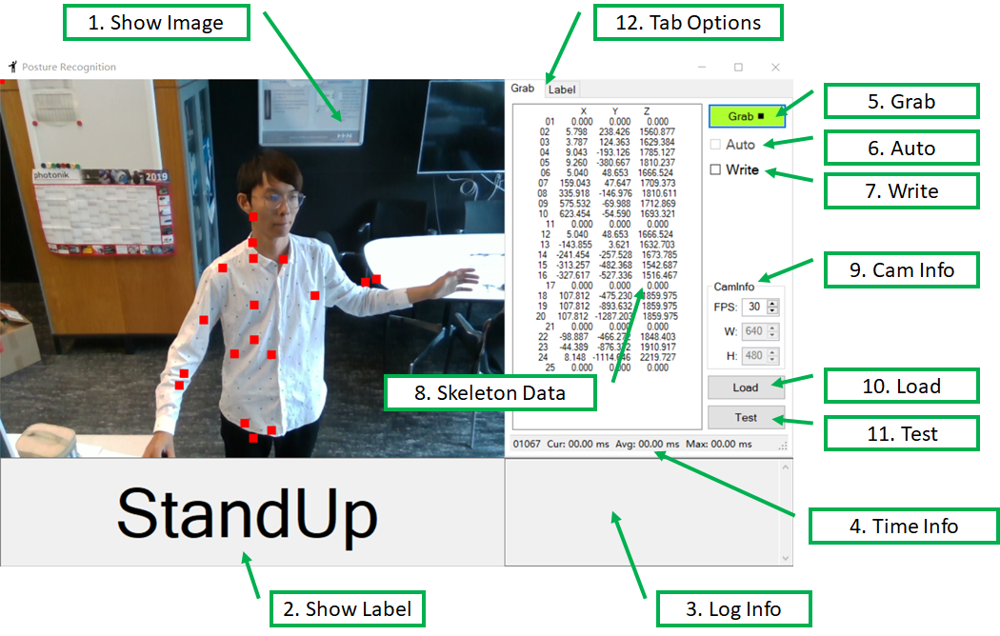
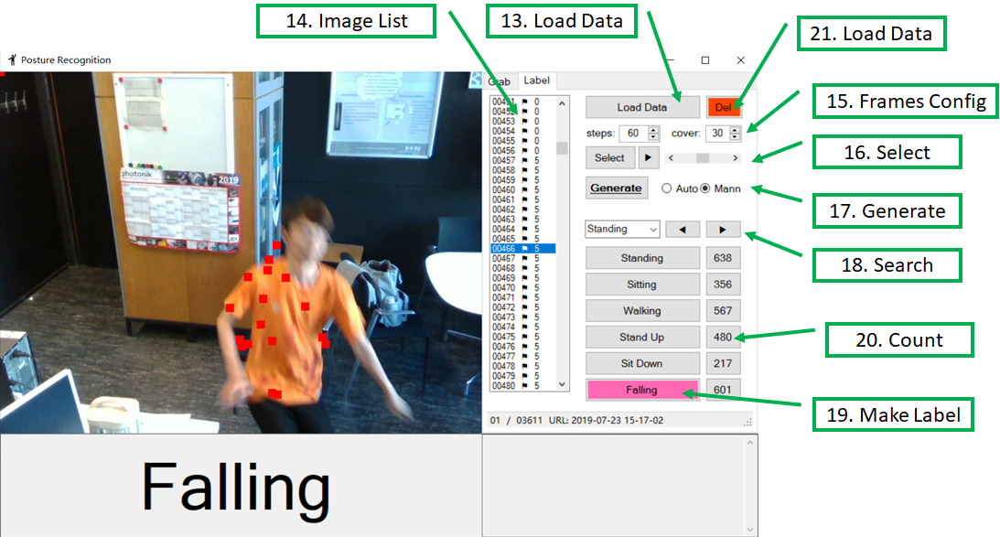

# PostureRecognition
This program uses Nuitrack SDK library to detect human body joints. Then input these data into a BiLSTM network to make posture prediction.

---
## 1 Real Sense
All instructions are based on `Real Sense 2.19.0` using `Depth Camera D435`.   

### 1-1 Viewer
- ### [Intel.RealSense.Viewer](https://github.com/IntelRealSense/librealsense/releases/download/v2.19.0/Intel.RealSense.Viewer.exe)
  + Executable depth camera control program
  + Configure depth camera and color camera parameters
  + Version: 2.19.0

### 1-2 SDK
- ### [Intel.RealSense.SDK](https://github.com/IntelRealSense/librealsense/releases/download/v2.19.0/Intel.RealSense.SDK.exe)
  + Installer with `Intel RealSense Viewer and Quality Tool`, `C/C++ Developer Package`, `Python 2.7/3.6 Developer Package`, `.NET Developer Package` and so on.
  + Version: 2.19.0

### 1-3 Extra Information
- Latest Version of Viewer and SDK: [Intel RealSense](https://github.com/IntelRealSense/librealsense/releases)
- https://realsense.intel.com/intel-realsense-downloads
- [Best Known Methods for Tuning Intel RealSense Depth Cameras D415 and D435](https://www.intel.com/content/dam/support/us/en/documents/emerging-technologies/intel-realsense-technology/BKMs_Tuning_RealSense_D4xx_Cam.pdf)

## 2 Nuitrack
All instructions are based on `NUITRACK 1.4.0`

### 2-1 Download
- SDK: [Nuitrack SDK](https://nuitrack.com/)  
  Support: Unity, Unreal Engine, C++, C# 
- Online Documents: [Nuitrack Online](http://download.3divi.com/Nuitrack/doc/)

### 2-2 Install
- [Installation Instructions ](http://download.3divi.com/Nuitrack/doc/Installation_page.html)   
  1. Download and run [nuitrack-windows-x64.exe](http://download.3divi.com/Nuitrack/platforms/nuitrack-windows-x64.exe) (for Windows 64-bit). Follow the instructions of the NUITRACK setup assistant. 
  2. Re-login to let the system changes take effect.
  3. Make sure that you have installed Microsoft Visual C++ Redistributable for Visual Studio on your computer. If not, install this package depending on your VS version and architecture:   
      + [Visual C++ Redistributable 2015 (x64)](https://download.microsoft.com/download/9/3/F/93FCF1E7-E6A4-478B-96E7-D4B285925B00/vc_redist.x64.exe)
      + [Visual C++ Redistributable 2017 (x64)](https://aka.ms/vs/15/release/VC_redist.x64.exe)

### 2-3 Examples
-   [nuitrack_console_sample/src/main.cpp](http://download.3divi.com/Nuitrack/doc/nuitrack_console_sample_2src_2main_8cpp-example.html)
-   [nuitrack_csharp_sample/Program.cs](http://download.3divi.com/Nuitrack/doc/nuitrack_csharp_sample_2Program_8cs-example.html) :star:
-   [nuitrack_gl_sample/src/main.cpp](http://download.3divi.com/Nuitrack/doc/nuitrack_gl_sample_2src_2main_8cpp-example.html)
-   [nuitrack_ni_gl_sample/src/main.cpp](http://download.3divi.com/Nuitrack/doc/nuitrack_ni_gl_sample_2src_2main_8cpp-example.html)

## 3 Software Framework
### 3-1 Interface-1: Grab

#### 1. Show Image
  Display the RGB image, and the skeleton data by red square dots.
#### 2. Show Label
  Display the judged gesture: `Standing`, `Sitting`, `Walking`, `StandUp`, `SitDown`, `Falling`.
#### 3. Log Info
  Log some important information during running.
#### 4. Time Info
  Log some time information like current processing time, average processing time and so on.
#### 5. Grab
  Start or Stop the camera grab.
#### 6. Auto
  Enabled or Disabled recognizing the posture automatically.
#### 7. Write
  Enabled or Disabled writing skeleton data to local disk.
#### 8. Skeleton Data
  Display the skeleton data, 25 points (XYZ, 75 float data) per frame.
#### 9. Cam Info
  - FPS: Frame per second, also timer grab interval equals 1000 FPS.
  - W: The width of image, read only.
  - H: The height of image, read only.
#### 10. Load
  Load a `.pb` model.
#### 11. Test
  Open the file dialog and choose a sample. Then make the prediction using the loaded model.
#### 12. Tap Option
  Click different tap option to switch between `Grab` and `Label`. `Grab` is used for grab videos. `Label` is used for making labels.
### 3-2 Interface-2: Label

#### 13. Load Data
  Select a `.txt` file. The file contains frame indices and skeleton data during the whole video.
#### 14. Frame List
  Display the frame list. The small flag indicates that the data of the index is valid. The last number means this frame has been labeled. Number means the label index.
#### 15. Frame Config
  - steps: how many frames does a sample need in maximum. Default: 60
  - cover: how many frames is coincided between two samples. Default: 30
#### 16. Select
  - Select: Select and display next batch frames automatically. Maximum selection number is `steps`
  - ScrollBar: Display speed control. Left: Slow, Right: Fast
#### 17. Generate
  - In `Auto` mode: Click `Generate` button, it will process all the data in the current frame list, then generate many samples according to `steps` and `cover`
  - In `Mann` mode: Click `Generate` button, it will process only the selected frames in the frame list, then generate only one sample
  - **If 'shift' key is pressed at the same time**, click `Generate` button, the program request you to choose a folder in wich all the data file locate. After you choose it, the program will automatically process all the existing data folder.
#### 18. Search
  Choose an existing label from the left box. Then click `◀` and `▶` to search for the last or next one.
#### 19. Make Label
  There are 6 labels when labeling. Choose at least one frame in the frame list, then click any button with the best label. It will update a `Data_labels.md` in the Raw data Output folder to record all the labels.
#### 20. Count
  The number showed the current number of each valid label.
#### 21. Delete
  If you want to cancl some existing labels to Empty, then choose the target frames in frame list, Click `Del`.   

### 3-3 Folder Tree
+-- Debug: Application.StartupPath      
|&nbsp;&nbsp;&nbsp;&nbsp;+-- Output: Save the skeleton data   
&nbsp;&nbsp;&nbsp;&nbsp;|&nbsp;&nbsp;&nbsp;&nbsp;&nbsp;&nbsp;+-- yyyy-MM-dd HH-mm-ss: Save the skeleton data    
&nbsp;&nbsp;&nbsp;&nbsp;&nbsp;&nbsp;&nbsp;&nbsp;&nbsp;&nbsp;|&nbsp;&nbsp;&nbsp;&nbsp;&nbsp;+-- Data.txt: Indices and skeleton data   
&nbsp;&nbsp;&nbsp;&nbsp;&nbsp;&nbsp;&nbsp;&nbsp;&nbsp;&nbsp;|&nbsp;&nbsp;&nbsp;&nbsp;&nbsp;+-- Data_labels.md: Indices and labels    

### 3-4 Running
