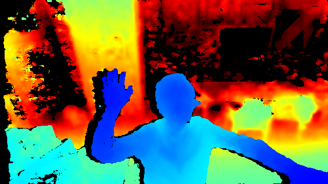

# PostureRecognition   
This program uses Nuitrack SDK library to detect human body joints. Then input these data into a BiLSTM network to make posture prediction.  

---
- [0 Environment](#0-environment)
- [1 Real Sense](#1-real-sense)
  * [1-1 Install](#1-1-install)
  * [[Intel.RealSense.SDK](https://github.com/IntelRealSense/librealsense/releases/download/v2.19.0/Intel.RealSense.SDK.exe)](#-intelrealsensesdk--https---githubcom-intelrealsense-librealsense-releases-download-v2190-intelrealsensesdkexe-)
  * [1-2 Extra Information](#1-2-extra-information)
- [2 Nuitrack](#2-nuitrack)
  * [2-1 Install](#2-1-install)
  * [2-2 Documents](#2-2-documents)
- [3 Software Framework](#3-software-framework)
  * [3-1 Interface-1: Grab](#3-1-interface-1--grab)
  * [3-2 Interface-2: Label](#3-2-interface-2--label)
  * [3-3 Folder Tree](#3-3-folder-tree)
  * [3-4 HOW TO USE IT](#3-4-how-to-use-it)
- [4 Deep Learning](#4-deep-learning)
  * [4-1 Network structure](#4-1-network-structure)
  * [4-2 Data distribution](#4-2-data-distribution)
  * [4-3 Training Parameters](#4-3-training-parameters)
  * [4-4 Accuracy](#4-4-accuracy)
  * [4-5 HOW TO USE IT](#4-5-how-to-use-it)
- [5 Issues](#5-issues)
  * [5-1 Unstable detecting for human joints because of a high position](#5-1-unstable-detecting-for-human-joints-because-of-a-high-position)
  * [5-2 More data](#5-2-more-data)
  * [5-3 Long cable](#5-3-long-cable)
  * [5-4 Joints match human body](#5-4-joints-match-human-body)
---
## 0 Environment
- System: Windows 10
- [Visual Studio Community 2017](https://visualstudio.microsoft.com/vs/older-downloads/)(C# is needed)
- [PyCharm Community 2019.2](https://www.jetbrains.com/pycharm/download/?utm_source=product&utm_medium=link&utm_campaign=PC&utm_content=2019.1#section=windows)
- [.NET Framework 4.7.1](https://www.microsoft.com/en-us/download/details.aspx?id=56116)
## 1 Real Sense
All instructions are based on `Real Sense 2.19.0` using `Depth Camera D435`.   

### 1-1 Install
- ### [Intel.RealSense.SDK](https://github.com/IntelRealSense/librealsense/releases/download/v2.19.0/Intel.RealSense.SDK.exe)
  + Installer with `Intel RealSense Viewer and Quality Tool`, `C/C++ Developer Package`, `Python 2.7/3.6 Developer Package`, `.NET Developer Package` and so on.
  + Version: 2.19.0

### 1-2 Extra Information
- Latest Version of Viewer and SDK: [Intel RealSense](https://github.com/IntelRealSense/librealsense/releases)
- https://realsense.intel.com/intel-realsense-downloads
- [Best Known Methods for Tuning Intel RealSense Depth Cameras D415 and D435](https://www.intel.com/content/dam/support/us/en/documents/emerging-technologies/intel-realsense-technology/BKMs_Tuning_RealSense_D4xx_Cam.pdf)

## 2 Nuitrack
All instructions are based on `NUITRACK 1.4.0`

### 2-1 Install
- [Installation Instructions ](http://download.3divi.com/Nuitrack/doc/Installation_page.html)   
  1. Download and run [nuitrack-windows-x64.exe](http://download.3divi.com/Nuitrack/platforms/nuitrack-windows-x64.exe) (for Windows 64-bit). Follow the instructions of the NUITRACK setup assistant. 
  2. Re-login to let the system changes take effect.
  3. Make sure that you have installed Microsoft Visual C++ Redistributable for Visual Studio on your computer. If not, install this package depending on your VS version and architecture:   
      + [Visual C++ Redistributable 2015 (x64)](https://download.microsoft.com/download/9/3/F/93FCF1E7-E6A4-478B-96E7-D4B285925B00/vc_redist.x64.exe)
      + [Visual C++ Redistributable 2017 (x64)](https://aka.ms/vs/15/release/VC_redist.x64.exe)

### 2-2 Documents
- SDK: [Nuitrack SDK](https://nuitrack.com/)  
  Support: Unity, Unreal Engine, C++, C# 
- Online Documents: [Nuitrack Online](http://download.3divi.com/Nuitrack/doc/)
  -   [nuitrack_console_sample/src/main.cpp](http://download.3divi.com/Nuitrack/doc/nuitrack_console_sample_2src_2main_8cpp-example.html)
  -   [nuitrack_csharp_sample/Program.cs](http://download.3divi.com/Nuitrack/doc/nuitrack_csharp_sample_2Program_8cs-example.html) :star:
  -   [nuitrack_gl_sample/src/main.cpp](http://download.3divi.com/Nuitrack/doc/nuitrack_gl_sample_2src_2main_8cpp-example.html)
  -   [nuitrack_ni_gl_sample/src/main.cpp](http://download.3divi.com/Nuitrack/doc/nuitrack_ni_gl_sample_2src_2main_8cpp-example.html)

## 3 Software Framework

### 3-1 Interface-1: Grab


#### 1. Show Image
  Display the RGB image, and the skeleton data by red square dots.
#### 2. Show Label
  Display the judged gesture: `Standing`, `Sitting`, `Walking`, `StandUp`, `SitDown`, `Falling`.
#### 3. Log Info
  Log some important information during running.
#### 4. Time Info
  Log some time information like current processing time, average processing time and so on.
#### 5. Grab
  Start or Stop the camera grab.
#### 6. Auto
  Enabled or Disabled recognizing the posture automatically.
#### 7. Write
  Enabled or Disabled writing skeleton data to local disk.
#### 8. Skeleton Data
  Display the skeleton data, 25 points (XYZ, 75 float data) per frame.
#### 9. Cam Info
  - FPS: Frame per second, also timer grab interval equals 1000 FPS.
  - W: The width of image, read only.
  - H: The height of image, read only.
#### 10. Load
  Load a `.pb` model.
#### 11. Test
  Open the file dialog and choose a sample. Then make the prediction using the loaded model.
#### 12. Tap Option
  Click different tap option to switch between `Grab` and `Label`. `Grab` is used for grab videos. `Label` is used for making labels.

### 3-2 Interface-2: Label


#### 13. Load Data
  Select a `.txt` file. The file contains frame indices and skeleton data during the whole video.
#### 14. Frame List
  Display the frame list. The small flag indicates that the data of the index is valid. The last number means this frame has been labeled. Number means the label index.
#### 15. Frame Config
  - steps: how many frames does a sample need in maximum. Default: 60
  - cover: how many frames is coincided between two samples. Default: 30
#### 16. Select
  - Select: Select and display next batch frames automatically. Maximum selection number is `steps`
  - ScrollBar: Display speed control. Left: Slow, Right: Fast
#### 17. Generate
  - In `Auto` mode: Click `Generate` button, it will process all the data in the current frame list, then generate many samples according to `steps` and `cover`
  - In `Mann` mode: Click `Generate` button, it will process only the selected frames in the frame list, then generate only one sample
  - **If 'shift' key is pressed at the same time**, click `Generate` button, the program request you to choose a folder in wich all the data file locate. After you choose it, the program will automatically process all the existing data folder.
#### 18. Search
  Choose an existing label from the left box. Then click `◀` and `▶` to search for the last or next one.
#### 19. Make Label
  There are 6 labels when labeling. Choose at least one frame in the frame list, then click any button with the best label. It will update a `Data_labels.md` in the Raw data Output folder to record all the labels.
#### 20. Count
  The number showed the current number of each valid label.
#### 21. Delete
  If you want to cancl some existing labels to Empty, then choose the target frames in frame list, Click `Del`.   

### 3-3 Folder Tree
>+-- Debug: Application.StartupPath      
>|&nbsp;&nbsp;&nbsp;&nbsp;+-- Output: Save the skeleton data   
>&nbsp;&nbsp;&nbsp;&nbsp;&nbsp;|&nbsp;&nbsp;&nbsp;&nbsp;&nbsp;+-- yyyy-MM-dd HH-mm-ss: Save the skeleton data    
>&nbsp;&nbsp;&nbsp;&nbsp;&nbsp;&nbsp;&nbsp;&nbsp;&nbsp;&nbsp;&nbsp;|&nbsp;&nbsp;&nbsp;&nbsp;+-- Data.txt: Indices and skeleton data   
>&nbsp;&nbsp;&nbsp;&nbsp;&nbsp;&nbsp;&nbsp;&nbsp;&nbsp;&nbsp;&nbsp;|&nbsp;&nbsp;&nbsp;&nbsp;+-- Data_labels.md: Indices and labels    

### 3-4 HOW TO USE IT

#### 3-4-1 Capture only
- Make sure the depth camera is connected.
- Click `5. Grab`, `1. Show Image` will display images in real time.
#### 3-4-2 Capture while automatically predicting
- Check `6. Auto` to choose a .pb model file. Then the program is in Auto mode. Click `5. Grab` to start capturing. The `2. Show Label` area will show the real time prediction.
#### 3-4-3 Capture while writing data
1. Firstly click `7. Write` button, the folder will be created under the `Output` folder with the format of current time `yyyy-MM-dd HH-mm-ss` as the folder name. For example, creating a folder named `2019-01-10 10-40-54`. 
    - Further, in the `2019-01-10 10-40-54` folder, a txt file named `Data.txt` is generated. 
    - `Data.txt`: The information of the skeleton data, also include the frame index. The first line is `Skeleton data (X, Y, Z) * 25 points. `, it will be ignored in the following processing. 
2. Secondly click `5. Grab` button to capture image, at the same time, write images and skeleton data to the `Data.txt`. 
- Tip: You can also check `6. Auto` and `7. Write` both. But the program will take more time to process.
#### 3-4-4 Make a test
1. Click `10. Load` to load an existing .pb model file.
2. Click `11. Test` to open the file dialog and choose a sample. Then make the prediction using the loaded model. The accuracy result will shown in `3. Log Info` area.
#### 3-4-5 Label
1. Click `12. Tap Option` to switch the program into Label mode.
2. Click `13. Load Data` to choose a `Data.txt` from the output folder. Then load the frames and skeleton data. The frame will be shown in `1. Show Image` area, the skeleton data will be shown in `14. Frame List` area. The small flag in the list indicates that the data under the index is valid.
3. Choose at least one frame in `14. Frame List`, then click the right button in `19. Make Label`, all the chosen frames will be labelled immediately (it's overwritten). The `20. Count` will count the number in each label.
4. If you made wrong labels and want to CANCL them, click `21. Delete`, the label will be reset to empty.
#### 3-4-6 Select automatically
- When you are making label, you don't neet to select frames mannually. You can set `15. Frame Config`. The first number steps means how many frames does a sample need in maximum, default value is 60. The second number cover means how many frames is coincided between two samples, default value is 30.
- Click `Select` button to do the automatic selection. The program will always generate a batch with `steps` frames. Move the scrollbar to control the display speed.
#### 3-4-7 Generate
- If you choose `Auto` mode, click the `Generate` button. The program will generate many samples from the whole `14. Frame List`.
- If you choose `Mann` mode, you need to choose some frames and click the `Generate` button. The program will generate only one sample according to the chosen frames.
- [One-Click Function] If you pressed `Shift` key, no matter in which mode, click the `Generate` button. Choose a folder that contains all the `yyyy-MM-dd HH-mm-ss` folders. The program will automatically generate samples through all the folders.
#### 3-4-8 Search
- Choose an existing label from the left box. Then click `◀` and `▶` to search for the last or next one.

## 4 Deep Learning
All the code is mainly based on `Python 3.7` and `Keras`. I utilize Bidirectional LSTM layer and Dense layer. The final accuracy is around 91%.

### 4-1 Network structure
I use Keras, and combine BiLSTM and Dense layer together. Due to the `Standing` and `Walking` is hard to distinguish. Even in the software framework, I make 2 labels for them. But when it turns to deep learning training, I regard these 2 labels as one label `Walking`. So there are only 5 classes in the end.   

### 4-2 Data distribution
#### By frame numbers:   
|       |  Sitting | Walking | Standup | Sitdown | Falling |   All   |
| :---: | :------: | :-----: | :-----: | :-----: | :-----: | :------:|
| train |  10744   |  13434  |   8947  |   3334  |  13270  |  49729  |
|  val  |    0     |    0    |    0    |    0    |    0    |    0    |
| test  |   2750   |  3779   |  2407   |   762   |  2877   |  12575  |
|  All  |   13494  |  17213  |  11354  |   4096  |  16147  |  62304  |
#### By sample numbers (many frames in one sample):     
|       |  Train | Val | Test | All |
| :---: | :------: | :-----: | :-----: | :-----: |
| train |  892   |  0  |   223  |   1115  |
### 4-3 Training Parameters
- batch_size_train=16
- batch_size_val=8
- epochs=15
- learning_rate=1e-4
- learning_rate_decay=1e-6
### 4-4 Accuracy
#### With CRF (Conditional Random Field)
|       |  Train | Train-Fall | Test | Test-Fall |
| :---: | :------: | :-----: | :-----: | :-----: |
| 1 |  0.9193   |  0.9414  |   0.9026  |   0.9369  |
| 2 |  0.9188   |  0.9469  |   0.9071  |   0.9529  |
| 3 |  0.9197   |  0.9541  |   0.8823  |   0.9449  |
| 4 |  0.9180   |  0.9502  |   0.8849  |   0.9323  |
| 5 |  0.9230   |  0.9493  |   0.8803  |   0.9374  |
#### Without CRF
|       |  Train | Train-Fall | Test | Test-Fall |
| :---: | :------: | :-----: | :-----: | :-----: |
| 1 |  0.9244   |  0.9552  |   0.8976  |   0.9156  |
| 2 |  0.9229   |  0.9266  |   0.8741  |   0.8220  |
| 3 |  0.9260   |  0.9437  |   0.8964  |   0.9142  |
| 4 |  0.9137   |  0.9387  |   0.8983  |   0.9415  |
| 5 |  0.9138   |  0.9426  |   0.8996  |   0.9357  |   

Tip: `Train-Fall` means only the `Falling` label accuracy in train set. Because this project puts more focus on the `Falling` posture.
### 4-5 HOW TO USE IT   
1. Please use Anaconda to create a new environment. Open the cmd, `cd` to the main folder where the *PostureRecognition.yml* is.    
  ```conda env create -f PostureRecognition.yml```   
  Then a new env is available. No matther which IDE you are using, make sure to run the `.py` file in the new env.   
2. run `./data/sample_reduce.py` to generate the training data. Because the data in `./data/Samples/` contains many 'Walking' and 'Standing' labels.   
3. run `train_sequence.py` to do the training and validation.

## 5 Issues

### 5-1 Unstable detecting for human joints because of a high position
Compared to [ZpRoc](https://github.com/ZpRoc/GestureRecognition), I fix the depth camera with a pillar in a high position (he put the depth camera on the desktop). It influences the performance of Nuitrack to detect the joints. Because Nuitrack suggests developers to put camera in a height [around 0.8m-1.2m](http://download.3divi.com/Nuitrack/doc/Preparations_page.html), but mine is around 2m. I guess the reason of the bad performance is because of the perspective relationship.
### 5-2 More data
I have only 1115 samples in total. Each of them contains about 60 frames. It's not a big dataset. So there should be more data.
### 5-3 Long cable
If you want to get a good performance of the depth camera, you should use **USB3** cable. I bought a long cable, but it's USB2, so sometimes the connection is bad.
### 5-4 Joints match human body
As you see from the software framework image just now, the joints don't match the human body so well. It's because the human body comes from RGB camera, and joints data come from depth camera. So if we want to match them, we need to do calibration.
## 6 Future Plan
Due to the bad performance of Nuitrack in detecting joints. We plan to use the raw depth image from the depth camera. Find where is the man, then find what is the man's posture.

